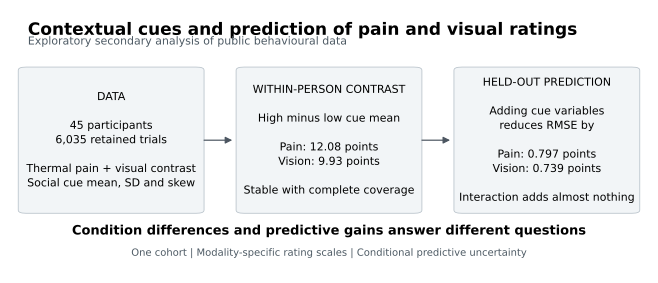

# Contextual cues and participant-held-out prediction

Reproducible code and calculations for an exploratory secondary analysis of pain and visual ratings. Author: Umut Şimşekçi. This is a code/results repository, not a published or peer-reviewed article.



## What was done

We analysed 6,035 retained trials from 45 participants in an existing cued-perception experiment. Three fixed weighted linear models were compared using leave-one-participant-out cross-validation, separately for pain and vision. All trials from the test participant were excluded from fitting and temporal scaling. Training and evaluation gave each participant equal weight.

| Modality | Sensory-only RMSE | Additive-cue RMSE | Improvement |
|---|---:|---:|---:|
| Pain | 22.4669 | 21.6695 | 0.7974 |
| Vision | 16.3524 | 15.6135 | 0.7389 |

Errors are in the original 0–100 rating units. Cue information modestly improved prediction of held-out participants. The additional cue-mean × cue-dispersion interaction did not materially improve prediction. These are not clinical predictions or evidence of treatment efficacy.

A post-protocol exploratory sensitivity analysis restricted matched contrasts to the 43 participants with complete condition coverage in each modality. The two sets differ (42 participants overlap). This sensitivity analysis did not refit the predictive models.

## Reproduce

Python 3.12 was used. Create an isolated environment, then run from the repository root:

```sh
python -m pip install -r requirements.txt
python 05_reproducibility/reproduce_and_validate.py
python 05_reproducibility/make_figures.py
```

The first command reruns the archived primary calculation, checks numerical agreement, independently reconstructs prediction metrics, and reproduces the documented coverage sensitivity. It writes five supplementary tables and a validation report. The second creates scientific figures and a graphical abstract in PNG, PDF, SVG and TIFF formats under `02_figures`. No network access is required after dependencies are installed. Exact byte hashes may differ across platforms; numerical tolerances are documented in the validation script. Running the scripts updates generated outputs.

## Files

- `05_reproducibility/analysis_run/analysis/empirical_boundary.py`: preserved primary analysis.
- `05_reproducibility/analysis_run/research/EMPIRICAL_PROTOCOL.md`: frozen exploratory protocol; not a prospective preregistration. Original published findings were already known.
- `05_reproducibility/analysis_run/data/empirical/`: source data, predictions, participant/cell summaries and provenance.
- `03_supplementary/`: results and sensitivity tables.
- `07_validation/prior_analysis_archive/`: reference numerical outputs used for computational checks.
- `05_reproducibility/data_dictionary.md`: variable and output definitions.

## Source and attribution

Botvinik-Nezer R, Geuter S, Lindquist MA, Wager TD (2025). *Expectation generation and its effect on subsequent pain and visual perception*. PLoS Computational Biology 21(5): e1013053. https://doi.org/10.1371/journal.pcbi.1013053

Source repository: https://github.com/rotemb9/PPRI-paper, release v2.0.0, commit `84dc29cdaefcf78de489e990419a8a398419cb6d`. Only the public processed cued-perception CSV and relevant upstream R code are included, with the original MIT notice in `05_reproducibility/analysis_run/data/empirical/source/LICENSE`. Source URLs and SHA-256 hashes are recorded in `provenance.json`. Upstream fitted prediction columns are not used to train the secondary models.

Upstream material remains under its original licence. No additional reuse licence has yet been assigned to the new secondary-analysis code; public visibility alone does not grant an open-source licence. Cite the original data paper and this repository separately when referring to them.

## Interpretation limits

The original experiment already investigated cue effects. Our additional contribution is a fixed participant-held-out predictive comparison and condition-coverage qualification. The analysis is exploratory, uses one cohort, and is not external validation or a new experiment. Bootstrap intervals resample participants; prediction intervals use fixed held-out scores without refitting and therefore do not fully account for model-training uncertainty or overlapping folds. No multiplicity adjustment or causal/clinical claim is made.

## Türkçe kısa açıklama

Bu depo, daha önce toplanmış açık deney verilerinde yaptığımız ikincil analizin kodlarını ve hesap sonuçlarını içerir. Katılımcının gördüğü ipucu modele eklendiğinde ağrı ve görsel puan tahminleri biraz iyileşti. Yeni bir deney yapmadık. Duyarlılık analizinde, gerekli deney koşullarının tamamında verisi bulunan kişileri seçerek ana karşılaştırmaların ne kadar değiştiğine baktık. Sonuçlar keşifseldir.
